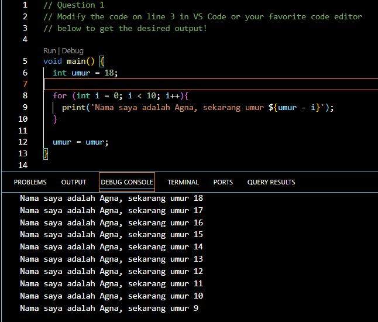
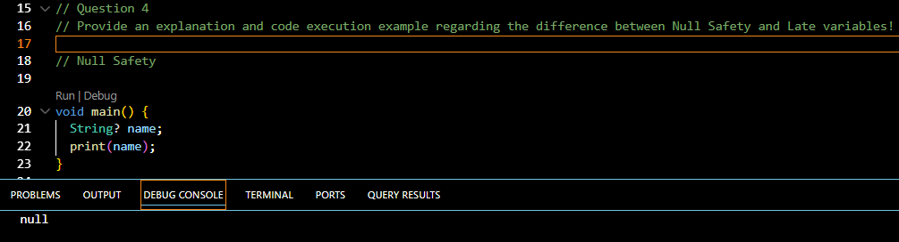
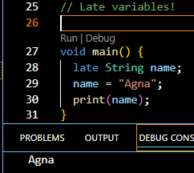

## Question 1
Modify the code so the output matches your name:
```dart:
void main() {
  int umur = 18;

  for (int i = 0; i < 10; i++){
    print('Nama saya adalah Agna, sekarang umur ${umur - i}');
  }

  umur = umur;
}
```
Output:


## Question 2
Why is it so important to understand the Dart programming language before using the Flutter framework? Explain!

Because Flutter uses Dart as its main programming language, understanding Dart is crucial before learning Flutter. It helps you:

- Understand the syntax and logic behind Flutter’s code.
- Build custom widgets and layouts more easily.
- Use OOP concepts (classes, objects, inheritance) to write clean and modular code.
- Debug efficiently using Dart’s strong typing and Flutter’s hot reload.
- Increase development speed and reduce errors because you know how the underlying language works.

## Question 3
Summarize the material from this codelab into key points that you can use to help you develop mobile apps using the Flutter framework.

Summary of Dart Material:

- Definition: Dart is a modern, object-oriented language developed  by Google. It is the foundation of Flutter and is used to build web, mobile, and desktop apps.

- Key Features:

  - Fast development with hot reload

  - JIT (Just-In-Time) and AOT (Ahead-Of-Time) compilation

  - Strong typing and null safety

  - Garbage collection and portability across platforms

- History: Released in 2011, became stable in 2013, and shifted focus to mobile development with Dart 2.0 in 2018.

- Basic Structure:

  - Every program starts with main()

  - Supports OOP (class, object, method)

  - Has common operators (arithmetic, relational, logical)

Learning Tools: You can learn and run Dart online using https://dartpad.dev/ 

## Question 4
Provide an explanation and code execution example of the difference between null safety and late variables.

Null Safety

- Prevents null reference errors by ensuring variables cannot be null unless explicitly marked as nullable.

- Use ? to make a variable nullable.



Late Variable

- Declares a variable that will be initialized later but must have a value before it is accessed.

- Useful when a variable’s value is not known during declaration.

