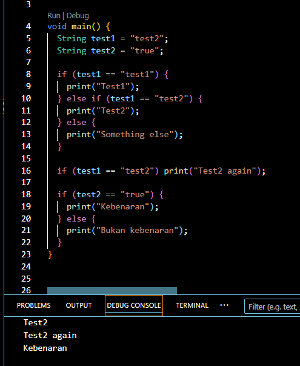
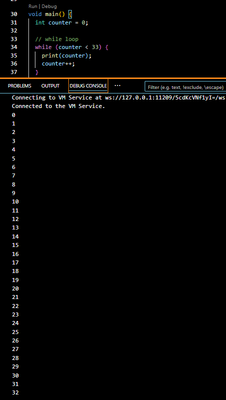
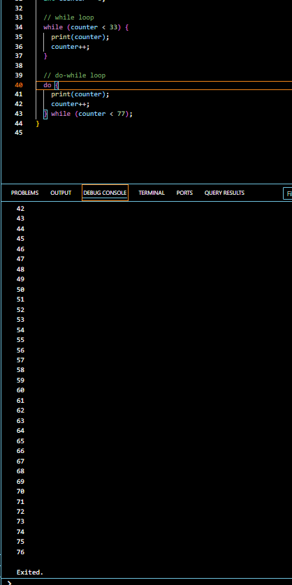
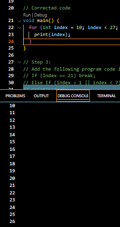
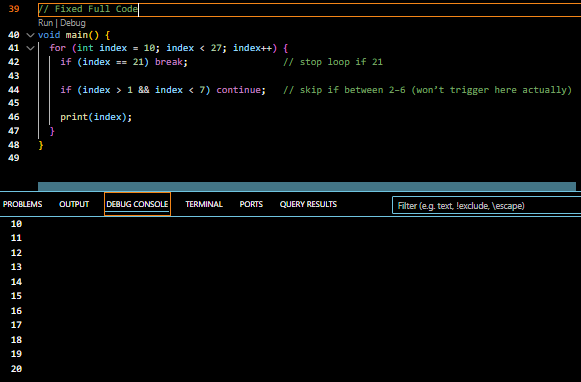

# Report codelab3

Name: Agna Putra Prawira
NIM:2341720065
Absent:01

## Practical 1
Practical 1: Implementing Control Flows ("if/else")

### Step 1:
Type or copy the following program code into the function main().

fix code
```dart:
void main() {
  String test1 = "test2";
  String test2 = "true";

  if (test1 == "test1") {
    print("Test1");
  } else if (test1 == "test2") {
    print("Test2");
  } else {
    print("Something else");
  }

  if (test1 == "test2") print("Test2 again");
}
```

### Step 2:
Please try executing the code in step 1. What happens? Explain!
Answer:
When executed, an error will appear (compilation failed).
The error is that the initial letters of If and Else statements are capitalized, whereas they should be lowercase (if and else) because Dart is case-sensitive.

### Step 3:
Add the following program code, then try executing (Run) your code.
```dart:
void main() {
  String test1 = "test2";
  String test2 = "true";

  if (test1 == "test1") {
    print("Test1");
  } else if (test1 == "test2") {
    print("Test2");
  } else {
    print("Something else");
  }

  if (test1 == "test2") print("Test2 again");

  if (test2 == "true") {
    print("Kebenaran");
  } else {
    print("Bukan kebenaran");
  }
}
```
What happened? If an error occurs, please fix it but continue using if/else
Answer:
cannot be executed because the test variable type is String, but if only accepts boolean (true/false), not text.

Output All Practical 1:



## Practical 2

Practical 2: Implementing "while" and "do-while" Loops

### Step 1:
Type or copy the following program code into the function main().
```dart:
void main() { 

while (counter < 33) {
  print(counter);
  counter++;
}

}
```

### Step 2:
Please try running the code in step 1. What happens? Explain! Then, correct any errors.
Answer:
because We must declare and initialize counter before using it, usually starting from 0

```dart:
void main() {
  int counter = 0;

  while (counter < 33) {
    print(counter);
    counter++;
  }
}
```
Output:



### Step 3:
Add the following program code, then try executing (Run) your code.

```dart:
do {
  print(counter);
  counter++;
} while (counter < 77);
```

If you add it after the while loop, counter will be 33 when the do-while starts.

fix code: 
```dart:
void main() {
  int counter = 0;

  // do-while loop
  do {
    print(counter);
    counter++;
  } while (counter < 77);
}
```

Output:



## Practical 3

 4. Praktikum 3: Menerapkan Perulangan "for" dan "break-continue"

 ### Step 1:
 Type or copy the following program code into the function main().

```dart:
 for (Index = 10; index < 27; index) {
   print(Index);
 }
````

 ### Step 2:
 Please try running the code in step 1. What happens? Explain! Then, correct any errors.

 - Index is not declared as a variable.

 - Index vs index mismatch (Dart is case-sensitive).

 - The for loop is missing index++ in the increment part (index alone does nothing).

```dart:
 Corrected code 
void main() {
  for (int index = 10; index < 27; index++) {
    print(index);
  }
}
```
Output:




 ### Step 3:
 Add the following program code inside the for-loop , then try executing (Run) your code.

 ```dart:
 If (Index == 21) break;
 Else If (index > 1 || index < 7) continue;
 print(index);
```

 Problems:

 - If and Else If must be lowercase → if and else if
 - Index should be index
 - index > 1 || index < 7 is always true (because any number is either >1 or <7); probably meant index > 1 && index < 7

 Fixed Full Code
 ```dart:
 void main() {
   for (int index = 10; index < 27; index++) {
     if (index == 21) break;                 // stop loop if 21

     if (index > 1 && index < 7) continue;   // skip if between 2–6 (won’t trigger here actually)
    
     print(index);
   }
 }
```

Output:



📌 What happens
 - Loop starts from 10 → prints 10, 11, 12, ...
 - When index == 21, break stops the loop completely.


## Practical Assignment

✅ Combine what you’ve learned from Practicals 1–3 (loops, conditions, break/continue)
✅ Write a Dart program that:
     - Loops from 0 to 201
     - Checks which numbers are prime numbers
     - If the number is prime, prints the number along with your full name and student ID.

Agna Putra Prawira – 2341720065
```dart:
void main() {
  for (int num = 0; num <= 201; num++) {
    if (isPrime(num)) {
      print('$num is prime → Agna Putra Prawira - 2341720065');
    }
  }
}

bool isPrime(int n) {
  if (n < 2) return false; // 0 and 1 are not prime
  for (int i = 2; i * i <= n; i++) {
    if (n % i == 0) return false;
  }
  return true;
}
```
Output:


Explanation:
- for loop goes from 0 to 201
- isPrime() checks if the number is prime by trying to divide it from 2 to √n
